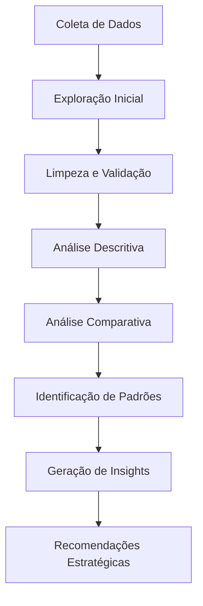

# 🎮 Análise de Vendas com IA: Dispositivos Portáteis de Jogos

[](https://www.dio.me/)
[](https://github.com/)
[](LICENSE)

> Projeto desenvolvido como parte do bootcamp da **Digital Innovation One (DIO)** sobre análise de dados utilizando prompts com ferramentas de Inteligência Artificial.

---

## 📋 Índice

- [Sobre o Projeto](#-sobre-o-projeto)
- [Objetivos](#-objetivos)
- [Dados Utilizados](#-dados-utilizados)
- [Metodologia](#-metodologia)
- [Principais Insights](#-principais-insights)
- [Tecnologias Utilizadas](#-tecnologias-utilizadas)
- [Estrutura do Repositório](#-estrutura-do-repositório)
- [Como Utilizar](#-como-utilizar)
- [Resultados](#-resultados)
- [Aprendizados](#-aprendizados)
- [Autor](#-autor)
- [Licença](#-licença)

---

## 🎯 Sobre o Projeto

Este projeto explora o poder dos prompts estruturados com ferramentas de IA para extrair insights estratégicos de dados de vendas reais. Através de uma análise detalhada de transações de dispositivos portáteis de jogos retro (handheld gaming consoles), demonstro como a engenharia de prompts pode transformar dados brutos em inteligência de negócios acionável.

### Contexto de Negócio

Analisamos dados de vendas de **duas marcas competidoras** (Anbernic e Meganium) que comercializam consoles portáteis de jogos retro através de múltiplas plataformas de e-commerce (Shopee, Etsy, AliExpress) para mercados internacionais.

**Período Analisado:** Maio a Novembro de 2024  
**Volume Total:** 120 transações | 341 unidades vendidas  
**Mercados:** Canadá, UK, Alemanha, Japão, Austrália, França, EUA

---

## 🎯 Objetivos

- ✅ Aplicar técnicas de engenharia de prompts para análise de dados
- ✅ Extrair insights estratégicos para tomada de decisão
- ✅ Comparar performance entre marcas competidoras
- ✅ Identificar oportunidades de crescimento e otimização
- ✅ Documentar processos técnicos de forma profissional
- ✅ Demonstrar uso prático de IA em contextos empresariais

---

## 📊 Dados Utilizados

### Datasets Principais

1. **Anbernic Sales Data** (30 transações)
   - Arquivo: `Updated_Anbernic_Sales_Data.csv`
   - Campos: produto, data, quantidade, preço, moeda, site, cupom, desconto, dados do comprador

2. **Meganium Sales Data** (90 transações)
   - Arquivos: 
     - `Meganium_Sales_Data.csv` (consolidado)
     - `Meganium_Sales_Data_-_Shopee.csv`
     - `Meganium_Sales_Data_-_Etsy.csv`
     - `Meganium_Sales_Data_-_AliExpress.csv`

### Estrutura dos Dados

```
Campos Principais:
├── product_sold: Nome do produto vendido
├── date: Data da transação
├── quantity: Quantidade vendida
├── unit_price: Preço unitário
├── total_price: Valor total
├── currency: Moeda (USD, EUR, GBP)
├── site: Plataforma de venda
├── discount_coupon: Código do cupom
├── discount_value: Valor do desconto
├── buyer_birth_date: Data de nascimento do comprador
├── buyer_name: Nome do comprador
├── delivery_country: País de entrega
└── invoice_id: ID único da fatura
```

---

## 🔬 Metodologia

### Ferramentas Utilizadas

- **Claude AI (Anthropic)** - Análise de dados e geração de insights
- **Engenharia de Prompts** - Técnicas estruturadas para extrair informações
- **GitHub** - Versionamento e documentação

### Processo de Análise



### Dimensões de Análise

1. **Performance por Marca** - Comparação Anbernic vs Meganium
2. **Análise de Produtos** - Modelos mais vendidos e rentáveis
3. **Canais de Distribuição** - Performance por plataforma
4. **Mercados Geográficos** - Distribuição por país
5. **Estratégia de Preços** - Precificação e descontos
6. **Padrões Temporais** - Sazonalidade e tendências

---

## 💡 Principais Insights

### 🏆 Top 3 Descobertas Estratégicas

#### 1. Dominância do Modelo RG 40XXV
- **Representa 35-40% das vendas** em ambas as marcas
- Preço premium de **$100** (ponto ideal entre custo e valor percebido)
- Alta aceitação em todos os mercados analisados
- **Recomendação:** Investir em variações e bundles deste modelo

#### 2. Concentração Geográfica Significativa
- **Canadá e UK representam 45%** das entregas
- Oportunidade clara de expansão em mercados asiáticos
- Logística pode ser otimizada com hubs estratégicos
- **Recomendação:** Estabelecer centros de distribuição no Canadá

#### 3. Dependência de Descontos
- **100% das transações** utilizaram cupons de desconto
- Desconto médio de **14-16%** sobre preço base
- Possível erosão de margem e percepção de valor
- **Recomendação:** Testar estratégias com preços "honestos" sem descontos

### 📈 Métricas-Chave

| Métrica | Anbernic | Meganium | Benchmark |
|---------|----------|----------|-----------|
| Transações | 30 | 90 | 3:1 |
| Volume Total | 94 unidades | 247 unidades | 2.6:1 |
| Ticket Médio | 3.13 un/tx | 2.74 un/tx | +14% |
| Desconto Médio | $52 | $48 | -8% |
| Canais Ativos | 3 | 4 | +33% |

### 🎯 Oportunidades Identificadas

1. **Diversificação de Canais (Anbernic)**
   - Reduzir dependência de Shopee/Etsy (83% das vendas)
   - Expandir para Amazon e outros marketplaces

2. **Expansão Geográfica**
   - Mercados asiáticos subexplorados (exceto Japão)
   - América Latina e Leste Europeu com potencial

3. **Otimização de Portfolio**
   - Focar em top 3 produtos (80% das vendas)
   - Descontinuar ou reformular modelos com baixa performance

4. **Estratégia de Preços**
   - Testar períodos sem descontos obrigatórios
   - Avaliar impacto na percepção de valor

---

## 🛠 Tecnologias Utilizadas

- **Claude AI** - Análise de dados e geração de insights
- **Python** (conceitual) - Processamento de dados
- **Markdown** - Documentação
- **Git/GitHub** - Controle de versão
- **CSV** - Formato de dados

---

## 📁 Estrutura do Repositório

```
project-root/
│
├── README.md                                    # Este arquivo
├── LICENSE                                      # Licença do projeto
│
├── data/                                        # Dados brutos
│   ├── Updated_Anbernic_Sales_Data.csv
│   ├── Meganium_Sales_Data.csv
│   ├── Meganium_Sales_Data_-_Shopee.csv
│   ├── Meganium_Sales_Data_-_Etsy.csv
│   └── Meganium_Sales_Data_-_AliExpress.csv
│
├── analysis/                                    # Análises e insights
│   ├── insights-estrategicos.md
│   ├── analise-comparativa.md
│   └── recomendacoes.md
│
├── prompts/                                     # Documentação de prompts
│   ├── prompts-utilizados.md
│   └── melhores-praticas.md
│
└── assets/                                      # Recursos visuais
    ├── graficos/
    └── diagramas/
```

---

## 🚀 Como Utilizar

### Pré-requisitos

- Acesso a uma ferramenta de IA (Claude, ChatGPT, etc.)
- Editor de texto ou IDE
- Git instalado (opcional)

### Passos para Replicar a Análise

1. **Clone o repositório**
```bash
git clone https://github.com/seu-usuario/analise-vendas-ia.git
cd analise-vendas-ia
```

2. **Explore os dados**
   - Abra os arquivos CSV na pasta `data/`
   - Familiarize-se com a estrutura

3. **Utilize os prompts documentados**
   - Acesse `prompts/prompts-utilizados.md`
   - Copie e cole os prompts em sua ferramenta de IA
   - Adapte conforme necessário

4. **Analise os insights**
   - Revise os documentos na pasta `analysis/`
   - Compare com seus próprios resultados

5. **Adapte para seu contexto**
   - Use os templates de prompt fornecidos
   - Ajuste para seus próprios datasets

---

## 📊 Resultados

### Dashboards Conceituais

#### Performance por Marca
```
Anbernic:  ████████░░░░░░░░░░░░ 30 transações
Meganium:  ████████████████████ 90 transações
```

#### Top 3 Produtos
```
1. RG 40XXV   ████████████████████ 40%
2. RG35XX     ███████████████░░░░░ 30%
3. RG353M     ██████████░░░░░░░░░░ 20%
```

#### Distribuição Geográfica
```
🇨🇦 Canadá:    ████████████░░░░░░░░ 25%
🇬🇧 UK:        ████████████░░░░░░░░ 20%
🇩🇪 Alemanha:  ██████░░░░░░░░░░░░░░ 12%
🇯🇵 Japão:     █████░░░░░░░░░░░░░░░ 10%
🇦🇺 Austrália: █████░░░░░░░░░░░░░░░ 10%
```

### Insights Visuais

| Categoria | Anbernic | Meganium | Vencedor |
|-----------|----------|----------|----------|
| **Volume Total** | 94 un | 247 un | 🏆 Meganium |
| **Ticket Médio** | 3.13 un | 2.74 un | 🏆 Anbernic |
| **Diversificação** | 3 canais | 4 canais | 🏆 Meganium |
| **Preço Médio** | $97 | $94 | 🏆 Anbernic |

---

## 🎓 Aprendizados

### Sobre Engenharia de Prompts

1. **Especificidade Gera Qualidade**
   - Prompts vagos = respostas superficiais
   - Prompts estruturados = insights profundos

2. **Contexto é Fundamental**
   - Fornecer contexto de negócio melhora análises
   - Relacionar dados com objetivos estratégicos é essencial

3. **Iteração Aprimora Resultados**
   - A primeira resposta raramente é a melhor
   - Follow-ups e refinamentos geram valor incremental

4. **Formato Importa**
   - Solicitar formatos específicos (tabelas, rankings)
   - Facilita consumo e aplicação dos insights

### Sobre Análise de Dados com IA

- ✅ IA acelera dramaticamente o processo de análise
- ✅ Prompts bem construídos substituem horas de programação
- ✅ Combinação humano + IA gera melhores insights que isoladamente
- ✅ Validação e senso crítico continuam essenciais
- ⚠️ IA não substitui conhecimento de domínio do negócio
- ⚠️ Sempre validar resultados com múltiplas fontes

### Habilidades Desenvolvidas

- [x] Engenharia de prompts para análise de dados
- [x] Análise descritiva e comparativa
- [x] Identificação de padrões e tendências
- [x] Geração de insights acionáveis
- [x] Documentação técnica profissional
- [x] Comunicação de resultados para stakeholders
- [x] Uso do GitHub para projetos de dados

---

## 🔄 Melhorias Futuras

### Próximas Análises

- [ ] **Análise de Coorte** - Comportamento de clientes ao longo do tempo
- [ ] **Análise Preditiva** - Projeções de vendas futuras com ML
- [ ] **Segmentação de Clientes** - Clustering baseado em comportamento
- [ ] **Análise de Margem** - Rentabilidade por produto/canal/região
- [ ] **A/B Testing** - Efetividade de estratégias de desconto
- [ ] **Lifetime Value** - Valor vitalício do cliente por segmento

### Expansões do Projeto

- [ ] Criar dashboards interativos (Power BI, Tableau)
- [ ] Automatizar coleta e análise de dados
- [ ] Implementar alertas para anomalias
- [ ] Integrar dados de custos e margem
- [ ] Adicionar dados de tráfego web e conversão
- [ ] Desenvolver modelo de recomendação de produtos

---

## 📚 Recursos e Referências

### Documentação do Projeto

- 📄 [Insights Estratégicos Completos](analysis/insights-estrategicos.md)
- 📝 [Prompts Utilizados](prompts/prompts-utilizados.md)
- 🎯 [Melhores Práticas](prompts/melhores-praticas.md)
- 💼 [Recomendações de Negócio](analysis/recomendacoes.md)

### Recursos Externos

#### Engenharia de Prompts
- [OpenAI Prompt Engineering Guide](https://platform.openai.com/docs/guides/prompt-engineering)
- [Anthropic Prompt Library](https://docs.anthropic.com/claude/prompt-library)
- [Prompting Guide](https://www.promptingguide.ai/)

#### Análise de Dados
- [Kaggle - Data Analysis Courses](https://www.kaggle.com/learn)
- [Towards Data Science](https://towardsdatascience.com/)
- [Analytics Vidhya](https://www.analyticsvidhya.com/)

#### GitHub e Documentação
- [GitHub Docs](https://docs.github.com/)
- [Markdown Guide](https://www.markdownguide.org/)
- [DIO - Formação GitHub](https://www.dio.me/)

---

## 🤝 Contribuindo

Contribuições são bem-vindas! Se você tem sugestões de melhorias:

1. Fork o projeto
2. Crie uma branch para sua feature (`git checkout -b feature/AmazingFeature`)
3. Commit suas mudanças (`git commit -m 'Add some AmazingFeature'`)
4. Push para a branch (`git push origin feature/AmazingFeature`)
5. Abra um Pull Request

### Áreas para Contribuição

- 📊 Novos prompts e técnicas de análise
- 📈 Visualizações de dados adicionais
- 🔍 Análises complementares
- 📝 Melhorias na documentação
- 🐛 Correção de erros ou inconsistências

---

## 👨‍💻 Autor

**[Seu Nome]**

- GitHub: [@seu-usuario](https://github.com/seu-usuario)
- LinkedIn: [Seu Perfil](https://linkedin.com/in/seu-perfil)
- Email: seu.email@exemplo.com

### Sobre Mim

Estudante apaixonado por dados e inteligência artificial, explorando como a IA pode transformar análise de dados e tomada de decisões empresariais. Este projeto faz parte da minha jornada de aprendizado no bootcamp da DIO.

---

## 🙏 Agradecimentos

- **Digital Innovation One (DIO)** - Pela oportunidade de aprendizado
- **Anthropic** - Pela ferramenta Claude AI
- **Comunidade Open Source** - Pela inspiração e recursos
- **Instrutores do Bootcamp** - Pela orientação e suporte

---

## 📜 Licença

Este projeto está sob a licença MIT. Veja o arquivo [LICENSE](LICENSE) para mais detalhes.

```
MIT License

Copyright (c) 2025 [Seu Nome]

Permission is hereby granted, free of charge, to any person obtaining a copy
of this software and associated documentation files (the "Software"), to deal
in the Software without restriction, including without limitation the rights
to use, copy, modify, merge, publish, distribute, sublicense, and/or sell
copies of the Software, and to permit persons to whom the Software is
furnished to do so, subject to the following conditions:

The above copyright notice and this permission notice shall be included in all
copies or substantial portions of the Software.

THE SOFTWARE IS PROVIDED "AS IS", WITHOUT WARRANTY OF ANY KIND, EXPRESS OR
IMPLIED, INCLUDING BUT NOT LIMITED TO THE WARRANTIES OF MERCHANTABILITY,
FITNESS FOR A PARTICULAR PURPOSE AND NONINFRINGEMENT. IN NO EVENT SHALL THE
AUTHORS OR COPYRIGHT HOLDERS BE LIABLE FOR ANY CLAIM, DAMAGES OR OTHER
LIABILITY, WHETHER IN AN ACTION OF CONTRACT, TORT OR OTHERWISE, ARISING FROM,
OUT OF OR IN CONNECTION WITH THE SOFTWARE OR THE USE OR OTHER DEALINGS IN THE
SOFTWARE.
```

---

## 📞 Contato e Suporte

Tem dúvidas ou sugestões? Entre em contato!

- 💬 Abra uma [Issue](https://github.com/seu-usuario/analise-vendas-ia/issues)
- 📧 Envie um email: seu.email@exemplo.com
- 🐦 Twitter: [@seu_twitter](https://twitter.com/seu_twitter)

---

## 🎯 Status do Projeto

```
✅ Análise exploratória de dados - CONCLUÍDO
✅ Identificação de insights estratégicos - CONCLUÍDO
✅ Documentação de prompts - CONCLUÍDO
✅ README detalhado - CONCLUÍDO
⏳ Dashboards visuais - EM PLANEJAMENTO
⏳ Análise preditiva - EM PLANEJAMENTO
```

---

<div align="center">

### ⭐ Se este projeto foi útil, considere dar uma estrela!

**Made with ❤️ and 🤖 AI**

[⬆ Voltar ao topo](#-análise-de-vendas-com-ia-dispositivos-portáteis-de-jogos)

</div>

---

## 📊 Estatísticas do Projeto


---

**Última atualização:** Outubro 2025